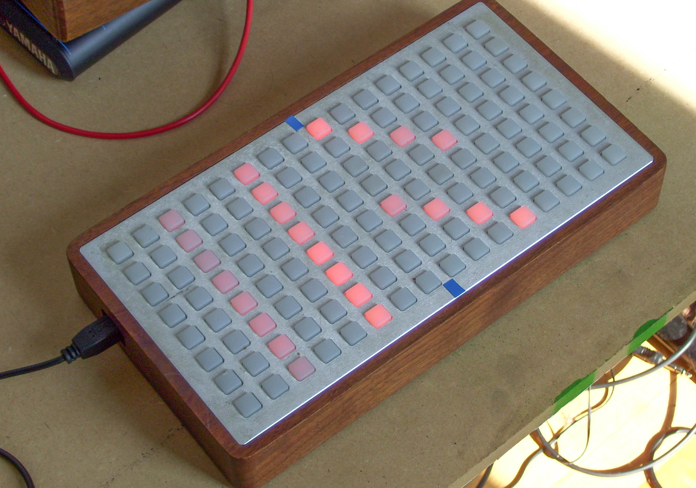
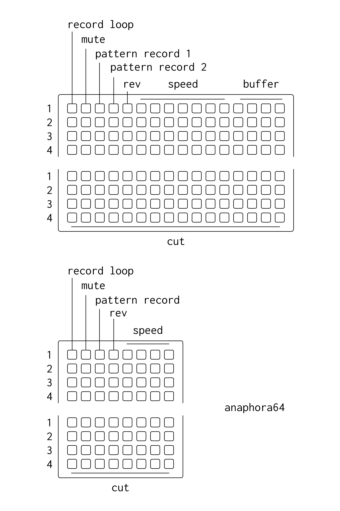
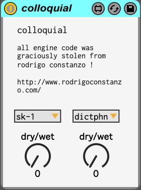
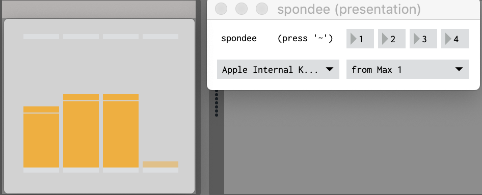
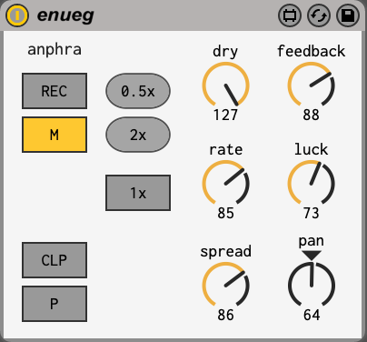
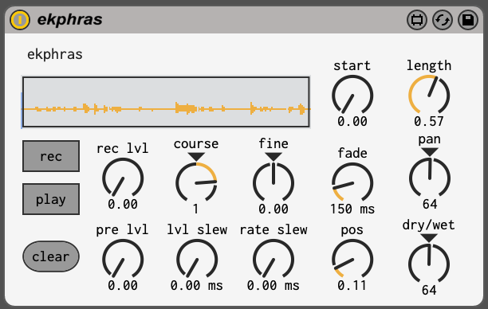

# prosody
iterative related concepts / suite of m4l devices for grids and no-grids

### Requirements

[Ableton Live](https://www.ableton.com/en/live/)

[Max for Live](https://www.ableton.com/en/live/max-for-live/)

some apps require either a [128 or 64 grid](https://monome.org/) from monome

### Contributers

[andrew c. s.](https://andrewcs.bandcamp.com/)

[dan derks](https://soundandprocess.com/)

# anachronsim

asynchronous digital tape looping interface for grids + max for live

### first steps

1.  open a live set, drop a device in a track.

2.  select your grid from the dropdown on anachronism

3.  press the top left key on the grid to create a loop. make a sound. press the top left key again to end recording.

4. recording while a channel is not playing results in a new loop.

5. speed controls both record and and play rate. hold two keys and release to glide - this is very expressive (!)

6. 'buffer' selects which buffer the voice reads/writes to (either 1-4 or 5-8) (there are 8 buffers). using separate voices to record to and pay back from buffer, for example, yields additional performance options.

7. pattern record captures key presses on the grid. cycle through record > (press some other buttons) > playback > reset. each pattern button only captures changes made on its own row.

8. on the standalone .amxd there are options for dry signal + voice levels, voice-wide overdub (for exploring delays), and voice-wide panning (width).

9. the current repo includes some beta tests - `ekphras.satellite` and `anachronism.remote`. place 4 or 8 instances of `ekphras.satellite` in Ableton (use the yellow selector at the top to assign the right row) along with the remote device. now `anachronism` is controlling each `ekphras`, which can be addressed individually with separate audio tracks and modulation sources. you can also drop samples into the buffer window.

10. an experiment: with multi-tracking set up, place the `.remote` device in a separate audio track from the `ekphras` tracks. the 'route' key now sends the audio out for the `ekphras` track to the track that the `remote` device is in. so, for example, if you set all your tracks to a common audio source, you can now route back into that main track and into the other loops from the grid.

# anaphora

playable varispeed delay/looper in max for live. a variation on mlr for grids. rough around the edges.

a sort-of-polished-up version of of a [norns mlr](https://llllllll.co/t/mlr-norns/21145/175)-inspired delay/looper. excels at expressive glitchy improv stuff.

differences from norns mlr include:

* a simplified 1-page / 4-buffer layout. lets you cut, repitch, record and switch buffers simultaneously, all of which can be pattern recorded.
* unlike `softcut`, the audio engine is home-brewed in max and has a lot of glitchy/rough edges, including buffer clicks & varispeed record/playback resampling artifacts. [think early-2000's microsound.](https://shop.christopherwillits.com/album/folding-and-the-tea) this is all semi-intentional and I'm not looking to alter the behavior for this app.
* alternate record speed / play speed / overdub architecture. at overdub(fb) = 0, record speed is locked at 1, speed controls playback. at overdub > 0, playback speed is locked at 1, speed controls record. honesty, no idea why I chose this behavior, but it can be fun.

### first steps

1.  open a live set, drop anaphora.amxd in an audio track and record enanable the track.

2.  select your 128 grid from the dropdown on anaphora. make sure 'focus' is enabled

3.  press the top left key on the grid to create a loop. make a sound. press the top left key again to stop the loop. you can also drag and drop existing audio into one of the waveform displays.

4. recording while a channel is muted results in a new loop.

explore ~

# colloquial

### quickstart

1.	drop colloquial.amxd in an audio track in ableton
2.	turn up a wet/dry knob, run some audio through
3.	hear ze beautiful distortions
4.	the two dropdowns set the modes. 1 for samplers & 1 for tapes

# spondee

divides the mac trackpad into four vertical faders outputting MIDI cc. while enabled, the trackpad cannot be used as a mouse, includes a toggle mapped to the '~' key.

### quickstart (ableton live)

(with ableton open & max/max trial installed)

1.  run spondee.mxf
2.  select the active keyboard on the left dropdown (this may take some trial & error)
3.  select the desired midi destination on the right dropdown (from max 1 is fine)
4.  the numbers on the top row set midi cc values. the defaults will work fine atm.
5.  in ableton hit ⌘m and click on a parameter to map
6.  hit '~' (which will enable spondee)
7.  moving your finger up & down on the far left of your trackpad will move the leftmost slider. this will also map your parameter in ableton
8.  hit '~' again
9.  click in the ableton window and hit ⌘m to exit midi mapping
10. become frustrated with the mapping process, especially as you look back and forth between these instructions and the programs
11. notice you can map four parameters and control them all at the same time in high resolution. that is why this program is useful vs. just using the mouse to control stuff. pairs well with synecdoche for keyboard playing.
12. have fun !

# synecdoche

### quickstart

1.	drop synecdoche.amxd in a midi track in ableton
2.	key map the 'q' key to disable the annoying hot swap preset shortcut thing (⌘k)
3.	select yr computer keyboard with the dropdown (this may take some trial & error)
4.	hit a key! it makes notes! the keys shown are the keys that map to notes. there's an octave separation btw rows on the keyboard.
5.	select notes in the scale where it says scale
6.  macs only register 3 simultaneous key presses at the same time :( only triads srry

# alliterate

key difference of this delay vs. other varispeed delays is that record speed is always = 0 & the buffer is always overdubbed at play speed = 1. setting speed to -0.5 is a good demonstration of how this works.

### quickstart

drop alliterate.amxd in an audio track in ableton

# enueg

feel like it's more fun not to say anything about this one? It's kind of a looper.

### quickstart

drop enueg.amxd in an audio track in ableton

# ekphras

this is pretty much just a max for live "wrapper" for [softcut](https://llllllll.co/t/norns-2-0-softcut/20550). just one voice (mono) w/ all the parameters exposed in a straightforward way so you can build your own interface around it with MIDI/automation. It can be used for looping, delaying, fo-granular-ing, and stuff in-between those things.

### quickstart

1.	drop ekphras.amxd in an audio track in ableton

# dirge

two resampling algorithms: one smooth, one jagged. run yr signal in either direction.

(macOS only at the moment)

### quickstart

drop dirge.amxd in an audio track in ableton

# assonance

### quickstart

drop assonance.amxd in an audio track in ableton

# hospital_food

m4l impression of nlc's let's splosh, designed for andrew's growing m4l collection.

I've been in the hospital for the last few days with a perforated appendix and while the nursing staff has been nothing but sweet, engaged and fun, the first 40 hours were super boring. when racquel was able to visit again, she brought my computer and I dove deep into the m4l tools that andrew has been releasing. they're absolutely incredible.

the only thing I wished for was a control / modulation layer. I love nlc's 'let's splosh', so I took the basic maths of the schematic and flipped it into a lil' m4l device that has plenty of mappings to control yr faves from andrew's suite!

the four foods have been renamed to the items I was allowed on my liquid diet:

GELATIN SHERBET JUICE BROTH

the device is basically made of four cycle~ objects following this comparator: 

### Documentation

1.  load up hospital_food.amxd on any track in Live.
2.  the two number boxes underneath each food will determine the frequency of each cycle~ device under the hood.
3.  the first box (float) will help keep things lfo-y. the second box (integer) is there as a multiplier, to help things get weird if you need it.
4.  once you have some float values selected for each food, you'll see the matrix of black boxes in the main part of the device rise, fall, and jump. it's working!
5.  to use these modulations, click Map and select the parameter on any device you'd like. you can even map hospital_food back onto itself! I like modulating two of the floats while keeping the other two constant.
6.  use the attenuators above each Map button to keep things "musically useful" -- I found that small modulation ranges can sometimes lead to more dramatic effects than big jumps, especially with filter cutoffs.
